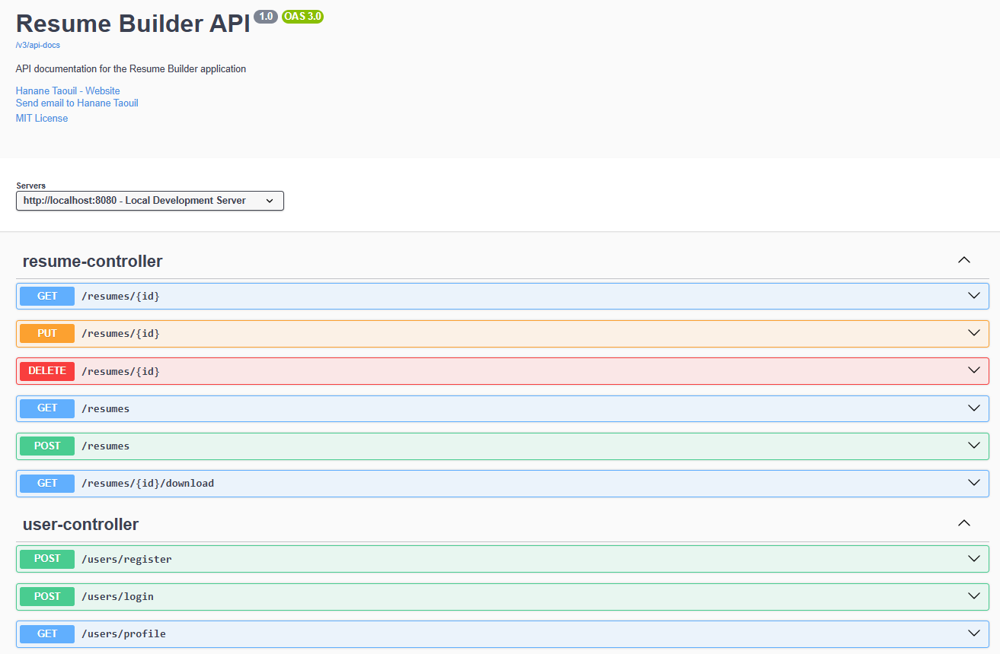

# Professional Resume Builder 🚀

A modern, full-stack web application that helps users create professional resumes with ease. Built with React, Spring Boot, and styled with a beautiful, responsive design.

Auth page:


Dashboard showing user's resumes:


Edit your resume info:


Preview your resume and have the option to download it as a PDF:


## ✨ Features

- 🔐 **Secure Authentication**
  - JWT-based authentication
  - Protected routes
  - Secure password handling

- 📝 **Intuitive Resume Creation**
  - Multiple professional templates
  - Rich text editing


- 💾 **Smart Data Management**
  - Version history
  - Export to PDF


## 🛠️ Tech Stack

### Frontend
- React 
- React Router 
- Axios
- React Icons
- React-to-PDF

### Backend
- Spring Boot 
- Spring Security
- JWT Authentication
- Spring Data JPA
- PostgreSQL
- Swagger/OpenAPI

## 🚀 Getting Started

### Prerequisites
- Node.js
- Java 17 or higher
- PostgreSQL
- Maven

### Installation

1. Clone the repository


2. Set up the backend
```bash
cd resume-builder-backend
mvn clean install
mvn spring-boot:run
```

3. Set up the frontend
```bash
cd resume-builder-frontend
npm install
npm start
```

4. Access the application
- Frontend: http://localhost:3000
- Backend API: http://localhost:8080
- Swagger Documentation: http://localhost:8080/swagger-ui.html

## 📚 API Documentation

The API documentation is available through Swagger UI. After starting the backend server, visit:
```
http://localhost:8080/swagger-ui.html
```


Key API endpoints:
- `/api/auth/*` - Authentication endpoints
- `/api/resumes/*` - Resume management
- `/api/templates/*` - Template management
- `/api/users/*` - User management


## 🔒 Security Features

- JWT-based authentication
- Password encryption
- CORS configuration
- Input validation


---

⭐️ From [Hanane](https://github.com/hanane54) 
